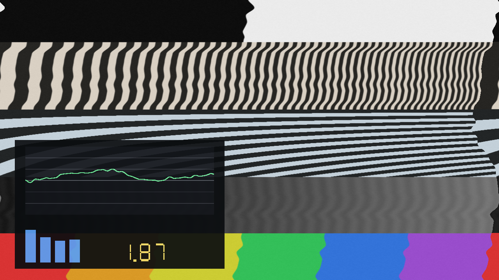

# ferric

> **AI-assisted project.** This codebase was created with [Claude](https://claude.com/claude-code)
> (Anthropic), directed and reviewed by a human author. It has been run in
> Resolume Arena 7.27.1 on macOS and on Windows — see [Status](#status) for
> exactly what that does and does not cover.

Put the picture on tape.

Ferric treats the video signal the way a cassette deck treats an audio one. A
transport that is never quite steady pulls it past the head, so the image leans,
waves and tears in time; the oxide adds its own hiss and loses contact here and
there; and the consumer sliding-band noise reduction that hid one under the other
is there too, with both ends of it under your control — which is where the
interesting damage lives.

An FFGL effect for **Resolume Arena and Avenue**.

**Video:** [What it does, in 50 seconds](https://www.youtube.com/watch?v=PccB5tL7rsQ)



*Show Trace on: the green plot is the error signal down the picture — the same
shape the image is being torn by — with the audio meters and a seven-segment
readout of weighted wow and flutter underneath.*

<!-- downloads:start -->

## Download

**[v0.1.3](https://github.com/stoatworks-labs/ferric/releases/tag/v0.1.3)** — prebuilt for macOS and Windows. Pick your platform:

<details>
<summary><b>macOS</b> — Universal (Apple Silicon + Intel)</summary>

| Build | Download | Size |
| --- | --- | --- |
| Universal (Apple Silicon + Intel) · .dmg disk image | [`ferric-0.1.3-macos-universal.dmg`](https://github.com/stoatworks-labs/ferric/releases/download/v0.1.3/ferric-0.1.3-macos-universal.dmg) | 231 KB |
| Universal (Apple Silicon + Intel) · .zip archive | [`ferric-macos-universal.zip`](https://github.com/stoatworks-labs/ferric/releases/latest/download/ferric-macos-universal.zip) | 192 KB |

</details>

<details>
<summary><b>Windows</b> — x64</summary>

| Build | Download | Size |
| --- | --- | --- |
| x64 · .exe installer | [`ferric-0.1.3-windows-x86_64-setup.exe`](https://github.com/stoatworks-labs/ferric/releases/download/v0.1.3/ferric-0.1.3-windows-x86_64-setup.exe) | 227 KB |
| x64 · .zip archive | [`ferric-windows-x86_64.zip`](https://github.com/stoatworks-labs/ferric/releases/latest/download/ferric-windows-x86_64.zip) | 121 KB |

</details>

All builds, checksums and release notes: [github.com/stoatworks-labs/ferric/releases](https://github.com/stoatworks-labs/ferric/releases).

macOS builds are signed and notarised and open normally. The Windows builds are unsigned, so SmartScreen warns once.

<!-- downloads:end -->

## The two ideas

**Wow and flutter is a timing error, and a picture read off tape is a signal with
a clock.** Every pixel gets a tape time, and one error signal is evaluated there.
Nothing else. Wow leans the whole frame; flutter draws a travelling wave down it
that *scrolls* between frames, because the clock moved; scrape flutter bands it
finely. And because tape time varies along the line as well as down the picture,
lines stretch rather than merely shifting — which is what real time-base error
does.

**Noise reduction is a round trip through a medium, and every artifact anybody
recognises is the two ends disagreeing.** So the chain here is the real chain, in
the real order:

    input → encode → [ tape: time-base error, hiss, dropouts ] → decode → out

The hiss gets bent once where the picture gets bent twice. Which means:

- **Decode with nothing encoded** and the picture goes dull and starts breathing —
  fine detail cut on the assumption it was boosted, by an amount that follows the
  picture's own content.
- **Encode with nothing decoding** and it goes hard and glassy, edges screaming.
- **Mistrack the levels** and the round trip cancels at some brightnesses and not
  others, so detail pumps as the shot changes. This is a tape recorded on one deck
  and played on another, and it is the control most worth reaching for.

The processing is **one-dimensional and horizontal**, because tape has one
frequency axis and it lands on the picture as the scan direction. Vertical edges
pump; horizontal ones sit perfectly still. That asymmetry is the effect, not a
shortcut — see [`source/Compander.h`](source/Compander.h).

## Controls

**Transport** — Machine (Cassette, Reel to Reel, Video Head, Failing), Wow, Wow
Rate, Flutter, Flutter Rate, Scrape, Drift, Tape Speed, Amount, Vertical.

**Tape** — Hiss, Dropouts, Head Wear.

**Noise Reduction** — NR Type (Off, Type B, Type C), NR Mode (Encode + Decode,
Decode Only, Encode Only), Mistracking, NR Strength.

**Reaction** — an audio input, Sync, Beat Depth, Beat Decay, Division, Level
Depth, Band Depth, Route. A beat puts a sharp excursion straight into the error
signal — the belt slipping — rather than modulating something already running,
because only the first of those reads as mechanical. Level hands the transport's
own wow and flutter over to the music. Band energy pushes the decoder off level,
so the noise reduction breathes with the mix.

Every reactive depth defaults to zero, so dropped on a layer with nothing routed
this is an ordinary manual tape emulation and behaves like one.

**Output** — Show Trace, Mix.

### Tape Speed, and the honest bit

A real 625-line picture scans at 15625 lines per second, and at that rate
audio-band flutter is a *constant* across the whole frame: no vertical structure,
no travelling wave, no tearing. Audio wow and flutter and video time-base error
are not the same phenomenon and do not live in the same band.

So this plugin does not pretend they do. It does what it says — runs a picture
through a **cassette transport** — and a cassette transport does not scan at 15625
lines a second. `Tape Speed` is that fiction, exposed: from about two milliseconds
of tape per picture, where the frame is rigid and only wow survives, to about two
seconds, where a single flutter cycle spans a few scanlines and the image comes
apart into ribbons.

### Show Trace

Draws the error signal as a function of position down the picture — the exact
quantity being applied — on a graticule marked at ±0.5 and ±1.0, with the five
band and beat meters underneath and a seven-segment readout of the weighted
wow-and-flutter figure.

That figure is measured the way a real meter measures it: the error is sampled at
2 kHz for four seconds, run through a DIN 45507 weighting curve, and the RMS of
the settled part is taken. The unit is a percentage of **one line period** rather
than of nominal tape speed, because there is no tape speed here to be a percentage
of. Expect readings an order or two worse than any deck ever shipped; that is the
point of an effect.

## Presets

Clean Deck, Compact Cassette, Chewed Tape, Undecoded, Wrong Deck, Head Clog,
Ribbons, Beat Slip, Breathing.

Seven leave every reactive depth at zero, so a preset picked with nothing routed
still behaves. The two that do not have it in their names.

## Build

Needs CMake 3.15+, a C++17 compiler, and the FFGL SDK submodule.

```bash
git clone --recursive https://github.com/stoatworks-labs/ferric
cd ferric
cmake -B build -DCMAKE_BUILD_TYPE=Release
cmake --build build
cmake --install build     # drops the bundle into Resolume's Extra Effects folder
```

macOS builds are universal (Apple Silicon + Intel) by default.

## Status

**What is verified, and how.** `tools/verify.sh` runs 23 checks against a clean
universal build. They drive the real plugin class through the real FFGL sequence
in a headless OpenGL 4.1 core context, and the built bundle is loaded through
`plugMain` the way a host loads it.

| check | what it establishes |
|---|---|
| `--tbe` | the GLSL error signal matches the C++ to 1.9e-5 over 6400 points — and a deliberately detuned transport **fails**, so the check can fail |
| `--identity` | neutral settings return the picture bit-exactly |
| `--roundtrip` | encode into decode cancels to 0.72 rms (Type B) and 1.31 (Type C) |
| `--denoise` | decoding really lowers the noise floor, and Type C's advantage grows as the material gets quieter |
| `--scan` | the compander moves vertical detail by 9.996 rms and horizontal detail by 0.000 |
| `--nr` | the GLSL gain law matches the C++ to 2e-7 |
| `--clock` | a milliseconds host and a seconds host render identical frames |
| `--drive`, `--echo` | the reaction arithmetic and the factory-preset logic, with no GPU |
| `tools/sweep.py` | all 27 controls reach the picture |

Render cost is 0.34 ms/frame at 1080p and 0.70 ms at 4K, with Type C and dropouts
running, on Apple Silicon.

### In Resolume

Verified in **Arena 7.27.1 rev 15990** on both platforms — the same host build on
each, so a difference between them is the plugin and not the host.

| | macOS | Windows |
|---|---|---|
| renderer | Apple M4 Max, GL 4.1 Metal 90.5 | Mesa llvmpipe, GL 4.5 Core |
| all three shader programs compile | yes | yes |
| parameters as the host reads them | 34, none truncated | 34, none truncated |
| dropdown elements complete | yes | yes |
| renders, trace overlay draws | yes | yes |
| weighted readout at identical settings | 3.43 | 3.43 |
| host clock unit detected | milliseconds | milliseconds |
| factory preset applies and holds | yes | yes |

The Windows run is the more interesting half: **llvmpipe is a completely
different GLSL compiler from Apple's**, so it genuinely catches shader source
that only ever compiled on one vendor. It says nothing about NVIDIA or AMD driver
quirks, and nothing at all about performance.

Two things that only a real host could establish:

- **Resolume sends `SetTime` in milliseconds**, confirmed — and on the macOS
  machine it was reading **499,217,238 ms**, which is 5.8 days of absolute clock.
  That makes the phase-wrapping in `Transport.h` load-bearing from the *first
  frame* rather than twenty minutes in: a naive `float` of that number resolves
  to 0.03 s, which is a fifth of a whole picture's worth of tape.
- **The factory-preset override pattern works.** A preset applied through the
  API stuck across nine seconds of Resolume restating its own values, and a
  manual edit of a covered control correctly released it back to Custom. That is
  the bug that cost this fleet a shipped release, and `--echo` could only
  simulate it.

**What is still NOT verified.** No operator has dragged a slider — every control
above was driven over the REST API, so inspector *layout* and feel are unjudged.
No NVIDIA or AMD driver has run it. There is no OpenFX build, and no release.

⚠️ During the Windows session Arena restarted once, at a point I could not
attribute to Ferric: there were no application crash events, the plugin had
already rendered correctly, and the instance that came up afterwards never
loaded Ferric at all. A stale Windows Firewall prompt for an unrelated
application was found sitting on that desktop, dating from four days earlier.
Recorded as unexplained rather than as either a pass or a fault.

## Licence

MIT. See [LICENSE](LICENSE) and [ATTRIBUTIONS.md](ATTRIBUTIONS.md).

The two noise-reduction curves are the well-known consumer sliding-band
companders, called **Type B** and **Type C** here. Those systems are Dolby
Laboratories' and the names are their trademarks; this is not their product, is
not licensed by them, and is not endorsed by them. No original coefficients or
reference designs were used — see [ATTRIBUTIONS.md](ATTRIBUTIONS.md).
